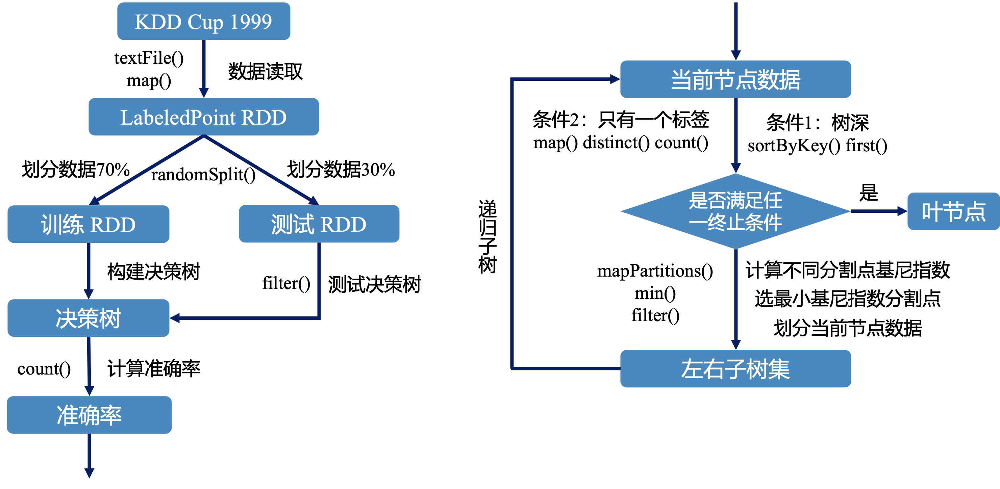
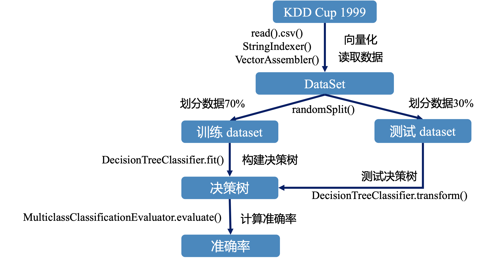
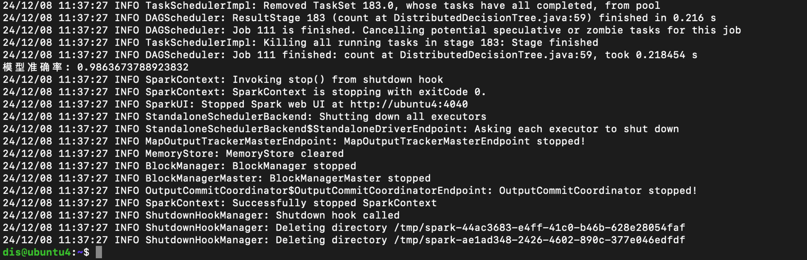
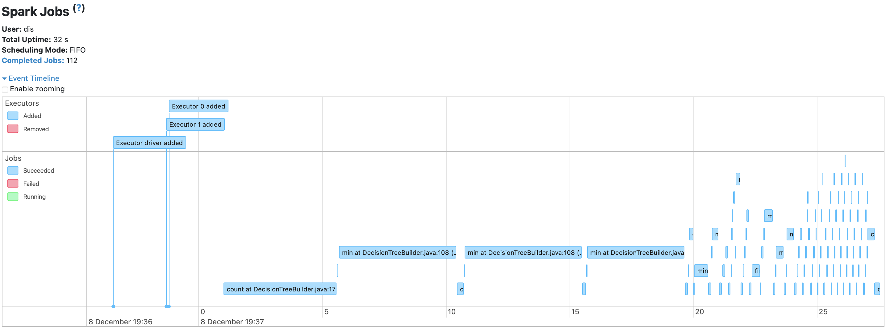
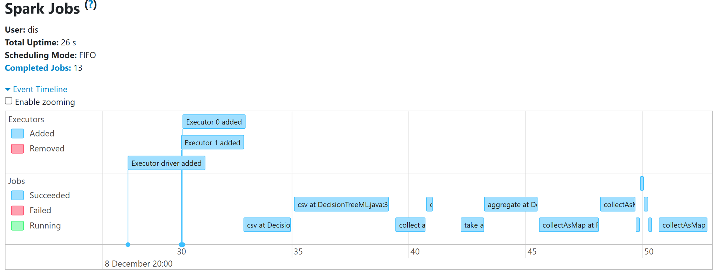
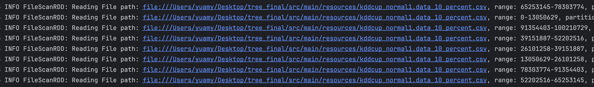
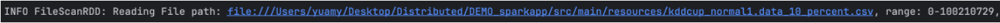
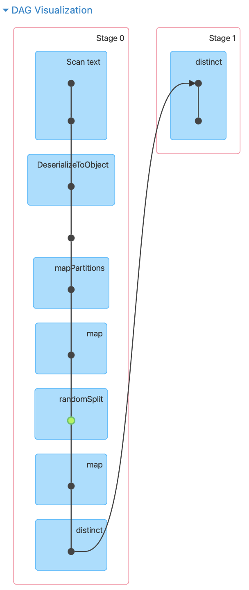

# 基于Spark的入侵检测和攻击识别

## 一、 实验目的
本实验采用Spark实现了一个网络入侵检测器，区分每个网络连接是否正常并标记可能受到的攻击种类。

1. 通过构建决策树模型预测是否受到网络攻击和网络攻击的类型

2. 基于RDD搭建的Manual决策树 vs. 基于MLlib搭建的ML决策树


## 二、 实验方法

### 1. 数据处理方法
#### KDD CUP99数据预处理

KDD Cup 1999数据集是与KDD-99第五届知识发现和数据挖掘国际会议同时举行的第三届国际知识发现和数据挖掘工具竞赛使用的数据集。竞争任务是建立一个网络入侵检测器，这是一种能够区分称为入侵或攻击的“不良”连接和“良好”的正常连接的预测模型。该数据集包含一组要审核的标准数据，其中包括在军事网络环境中模拟的多种入侵。

数据集下载地址：http://kdd.ics.uci.edu/databases/kddcup99/kddcup99.html


选择下载10%的子数据集作为我们此次分布式处理的数据：**kddcup.data_10_percent.gz**

- 解压文件后，文件总共有42项特征，最后一列是标记特征（Label），其他前41项特征共分为四大类。

  TCP连接基本特征（共9种，序号1～9）

  TCP连接的内容特征（共13种，序号10～22）

  基于时间的网络流量统计特征 （共9种，序号23～31）

  基于主机的网络流量统计特征 （共10种，序号32～41）

- 首先我们将所有特征中的**字符型数据转化为数值型数据**。比如：protocol_type - 协议类型，离散类型，共有3种：TCP, UDP, ICMP；我们将文件中的这些类型转换为0，1，2数值型数字

  ```py
  python rm_number.py
  ```

- 取出所有的特征除去标签列存为文件 kddcup.data_10_percent.csv

  ```py
  python feature.py
  ```

- 对特征数据 kddcup.data_10_percent.csv进行预处理

  方式一：**标准化**处理

  ```py
  python normal_data.py
  ```

  方式二：**最值归一化**处理

  ```
  python find_one.py
  ```
### 2. 模型实现
#### 自定义决策树实现
基于 Spark 的 RDD ，实现节点分裂、基尼指数计算、递归树构建等核心算法，构建一个决策树分类器。结构如图所示。



#### Spark MLlib 决策树分类器
利用 Spark MLlib 提供的 DecisionTreeClassifier，配置相应的参数，训练决策树分类模型。结构如图所示。



### 3. 模型评估
评估指标：分类的准确率

性能对比：对比自定义决策树和 MLlib 决策树在KDD Cup 1999上的训练时间和资源消耗。


## 三、 实验结果与分析

### 1. 单机与分布式环境下自定义决策树的表现
- 在单机中运行时间为53s左右，模型准确率为0.9545


- 在分布式中运行时间为32s左右，模型准确率为0.9928

  

- 。。

### 2. 基于RDD和基于MLlib决策树在分布式环境中的性能比较

- 基于RDD的决策树

  - 产生了112个jobs，运行时间约为32秒

  
- 基于MLlib的决策树

  - 产生了13个jobs，运行时间约为26秒，效果更佳

  


### 3. 结果的原因分析

1） 在单机FileScanRDD中


- ML没有分区，直接全部读入；
- Manual的分成了八个分区，分别读入；

  

  

2） 在分布式DAG中


- count：ML vs. Manual

    


## 四、分工

经清源：ML决策树和集群搭建，PPT和报告

刘佳凡：数据处理和集群搭建，PPT和报告

沈王梦：Manual决策树，PPT和报告

翟怡丹：PPT和报告


  


