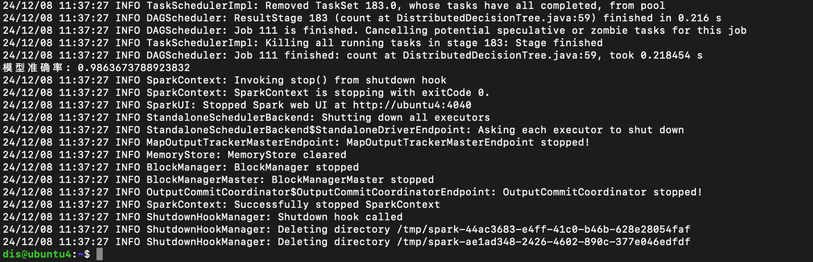

# 基于决策树的入侵检测和攻击识别

## 1. 目的
本项目致力于采用spark和RDD，开发一个网络入侵检测器，区分每个网络连接为正常的或是某个具体的攻击类型，最后比较分布式和伪分布式上的实验结果，以及是否采用ml的实验结果。


## 2. 方法

### 1）数据处理方法
#### KDD CUP99数据预处理

KDD Cup 1999数据集是与KDD-99第五届知识发现和数据挖掘国际会议同时举行的第三届国际知识发现和数据挖掘工具竞赛使用的数据集。竞争任务是建立一个网络入侵检测器，这是一种能够区分称为入侵或攻击的“不良”连接和“良好”的正常连接的预测模型。该数据集包含一组要审核的标准数据，其中包括在军事网络环境中模拟的多种入侵。

数据集下载地址：http://kdd.ics.uci.edu/databases/kddcup99/kddcup99.html


选择下载10%的子数据集作为我们此次分布式处理的数据：**kddcup.data_10_percent.gz**

- 解压文件后，文件总共有42项特征，最后一列是标记特征（Label），其他前41项特征共分为四大类。

  TCP连接基本特征（共9种，序号1～9）

  TCP连接的内容特征（共13种，序号10～22）

  基于时间的网络流量统计特征 （共9种，序号23～31）

  基于主机的网络流量统计特征 （共10种，序号32～41）

- 首先我们将所有特征中的**字符型数据转化为数值型数据**。比如：protocol_type - 协议类型，离散类型，共有3种：TCP, UDP, ICMP；我们将文件中的这些类型转换为0，1，2数值型数字

  ```py
  python rm_number.py
  ```

- 取出所有的特征除去标签列存为文件 kddcup.data_10_percent.csv

  ```py
  python feature.py
  ```

- 对特征数据 kddcup.data_10_percent.csv进行预处理

  方式一：**标准化**处理

  ```py
  python normal_data.py
  ```

  方式二：**最值归一化**处理

  ```
  python find_one.py
  ```
### 2）模型实现
#### 自定义决策树实现
基于 Spark 的 RDD ，实现节点分裂、基尼指数计算、递归树构建等核心算法，构建一个决策树分类器。结构如图所示。\
（放图）
#### Spark MLlib 决策树分类器
利用 Spark MLlib 提供的 DecisionTreeClassifier，配置相应的参数，训练决策树分类模型。结构如图所示。\
（放图）
### 3）模型评估
评估指标：分类的准确率\
性能对比：对比自定义决策树和 MLlib 决策树在KDD Cup 1999上的训练时间和资源消耗。


## 3. 结果

### 1）准确率情况
本次实验准确率较高，效果良好：

### 2） 分布式与伪分布式

- spark local的运行时间约为33秒，模型准确率约为0.95454
- 分布式的运行时间约为53秒，模型准确率约为0.99279

### 3）ML与手动搭建
ML决策树与手动搭建的决策树的运行情况分别如下：  


- ML决策树的运行时间约为26秒，手动构建的决策树的运行时间约为32秒，ML决策树效果更佳；
- ML决策树的completed jobs数量约为13个，而手动构建的决策树的completed jobs数量约为112个；
- 单机 FileScanML没有分区，直接全部读入，Manual的分成了八个分区，分别读入；
- 
- ML决策树的DAG，与手动决策树的DAG不同，分别展示如下：
-  
-   

## 4. 分工

项目成员的分工


  


